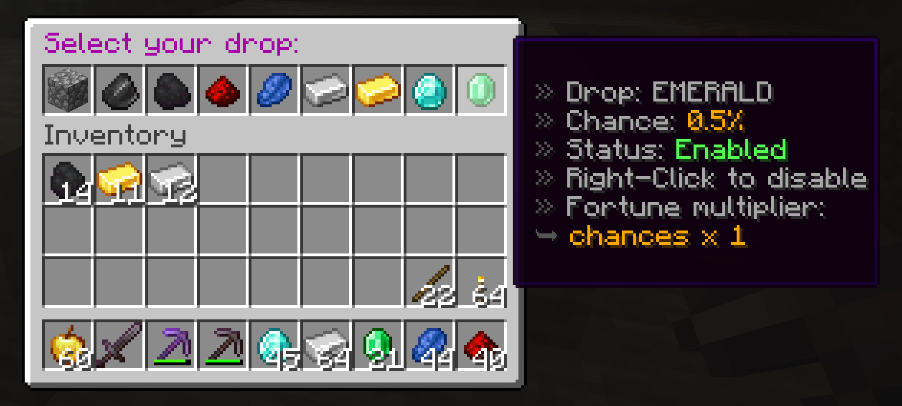

# Minecraft-Mining-Menu
A Minecraft 1.19 plugin that enables chosen drops from mined stone.
This plugin uses [PaperMC API](https://papermc.io/).

Command to use:
```java
/drop
```


Using a pickaxe with Fortune enchantment increases the drop chance.