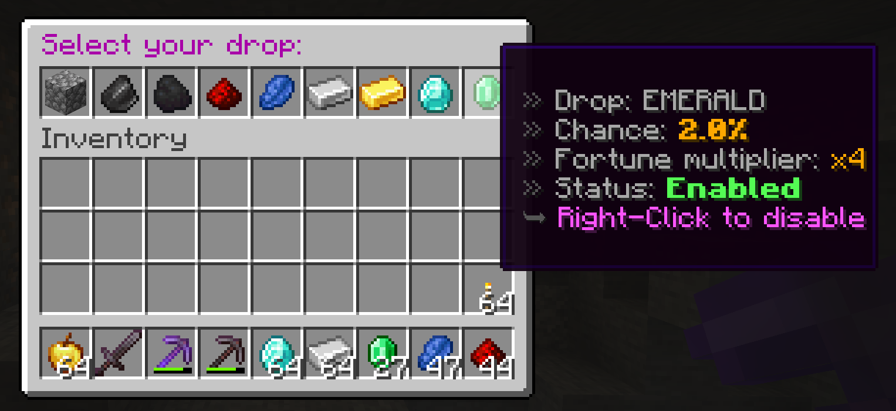

# Minecraft-Mining-Menu
A Minecraft 1.19 plugin that enables chosen drops from mined stone.
This plugin uses [PaperMC API](https://papermc.io/).

Command to use in game:
```java
/drop
```


Using a pickaxe with Fortune enchantment increases the drop chance.<br />
Player settings are being saved in ```player-drop-settings.json``` file, which is automatically created upon first run. The plugin uses [Google Gson](https://mvnrepository.com/artifact/com.google.code.gson/gson) to serialize the PlayerDropSettings to json format.